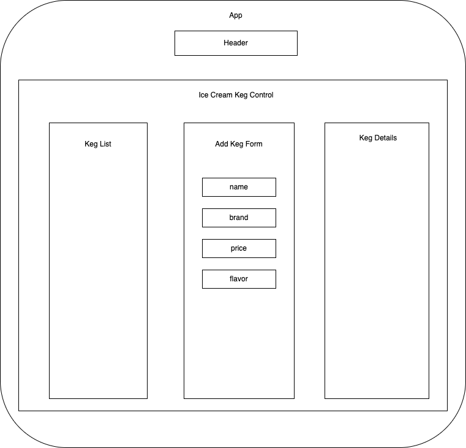

# Ice Cream Shop

## By _Alex McKnight_

### An inventory management project for an Ice Cream Parlor

## App Diagram



## Technologies Used

* React
* JavaScript

## Description

Using React and JavaScript, this project is a practice in state management using an app for inventory for an Ice Cream Parlor.

## Setup/Installation Requirements

* Clone this repository to your local machine.
* In the project's root folder, type ```npm install``` in your terminal to install the project's dependencies.
* Next type ```npm start``` in your terminal to start the program, it will open the project at [http://localhost:3000](http://localhost:3000), and you will be able to view in your browser.
* To end the program, type ```CMD+C``` on MacOs or ```Windows+C``` on PC in your terminal.

## Known Bugs

* None at this time

## License

MIT License

Copyright (c) [2022] Alex McKnight